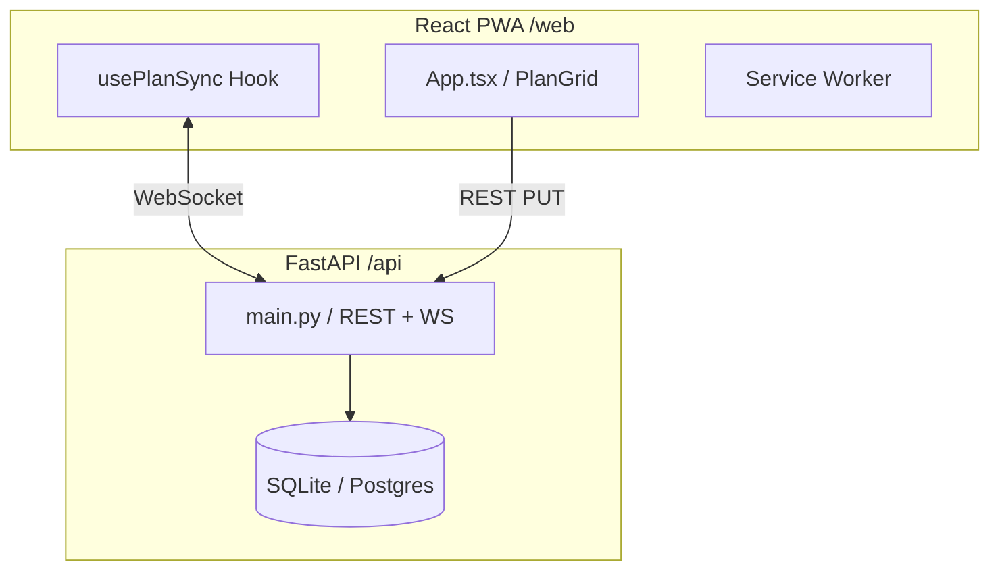

# Codebase Map — FridgePlan

## Architecture Overview

FridgePlan follows a decoupled client-server architecture optimized for real-time synchronization across multiple "always-on" surfaces (fridge tablet) and mobile clients.

## Data Flow

1. **Initial Load**: Client fetches the full plan via `GET /api/plan`.
2. **Update**: Client updates a specific slot via `PUT /api/plan/{id}`.
3. **Persistence**: Backend saves change to DB (SQLModel).
4. **Broadcast**: Backend fan-outs a `slot.updated` message to all connected WebSocket clients.
5. **Reconciliation**: Clients receive the message and update their local state via the `usePlanSync` hook, ensuring all screens stay in sync.

## Key Contracts

### Data Models (SQLModel/Pydantic)

**MealSlot**
- `id: int` (Primary Key)
- `day: int` (0-6, Monday-Sunday)
- `slot: int` (0=Breakfast, 1=Lunch, 2=Dinner)
- `text: str` (The meal content)
- `person: str | None` (jesse | dorys | null for both)
- `state: str` (planned | fasting | skipped | eaten)
- `updated_at: datetime`

### API Endpoints

- `GET /api/plan`: Returns full list of 21 slots.
- `PUT /api/plan/{slot_id}`: Updates slot content and triggers broadcast.
- `POST /api/reset`: Nukes DB and re-seeds from `SEED_PLAN`.
- `GET /api/health`: Basic availability check.

### WebSocket Events

- **Inbound**: None (clients only listen).
- **Outbound**:
  - `{"type": "slot.updated", "data": <MealSlot>}`
  - `{"type": "plan.reset"}`

## Technical Debt & Gaps

### Security
- **Auth**: Currently non-existent. Relies on private deployment (Tailscale) as per Phase 0 design.
- **CORS**: Currently set to `allow_origins=["*"]`. Must be tightened to specific Netlify/Local URLs in production.

### Reliability
- **Offline Mode**: `vite-plugin-pwa` is configured, but offline editing and reconciliation logic (IndexedDB) is not yet implemented (Phase 1).
- **Error Handling**: Minimal backend error handling for invalid payloads.

### Accessibility & UI
- **Touch Targets**: Standard buttons are used; need to verify 44px targets for the tablet interface.
- **i18n**: Logic for Spanish strings is not yet implemented (all strings are hardcoded in JSX).

### Quality
- **Tests**: `api/tests/` exists but is currently empty. `web/` has no unit tests.
- **Types**: Some payload handling in `main.py` uses `dict` rather than Pydantic models.
